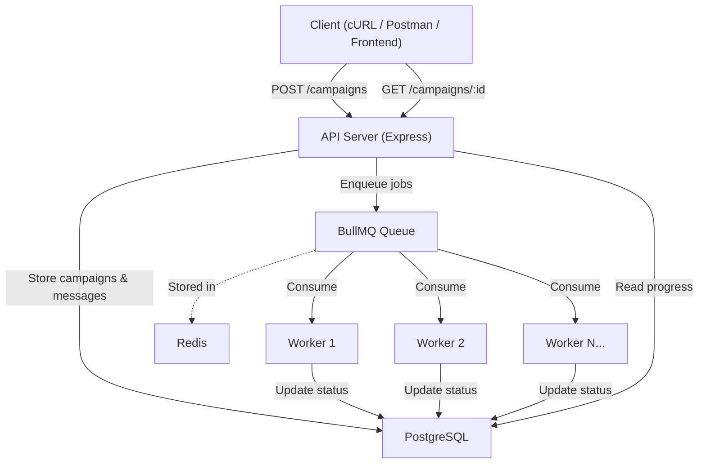
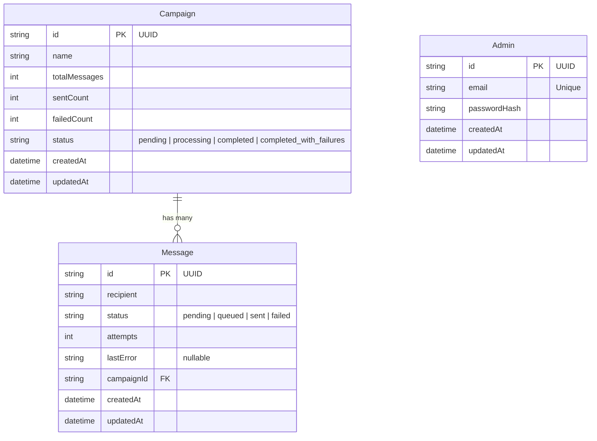

# Architecture

## Overview

The Distributed Notification Service is a backend system designed to send large volumes of notifications (emails, SMS, push) reliably without overwhelming the API server. It uses a **queue-based, event-driven architecture** that decouples the request acceptance from the actual message delivery.

## System Architecture



## How It Works

### Request Flow

1. A client sends `POST /campaigns` with a campaign name and recipient count.
2. The API creates a `Campaign` record and batch-inserts all `Message` records into PostgreSQL within a single database transaction.
3. The API pushes one BullMQ job per message into the Redis-backed notification queue.
4. The API returns `HTTP 202 Accepted` immediately — the client does not wait for delivery.
5. The campaign status transitions from `pending` to `processing`.

### Processing Flow

1. One or more Worker processes listen to the notification queue.
2. Each worker pulls jobs, attempts to deliver the notification, and updates the message status in PostgreSQL (`sent` or `failed`).
3. If delivery fails, BullMQ automatically retries up to 3 times with **exponential backoff** (1s, 2s, 4s delays).
4. After the final retry, permanently failed messages are marked as `failed` and the campaign's `failedCount` is incremented.
5. When all messages are processed, the campaign status transitions to `completed` or `completed_with_failures`.

### Polling Flow

Clients can poll `GET /campaigns/:id` to check real-time progress, which returns a breakdown of messages by status (pending, sent, failed).

## Tech Stack

| Component | Technology | Purpose |
|-----------|-----------|---------|
| API Server | Express + TypeScript | HTTP endpoint for campaign management |
| Database | PostgreSQL 16 | Persistent storage for campaigns and messages |
| Message Queue | Redis 7 + BullMQ | Job queue for async notification processing |
| Worker | Node.js + BullMQ Worker | Consumes and processes notification jobs |
| ORM | Prisma | Type-safe database access and migrations |
| Containerization | Docker + Docker Compose | Reproducible infrastructure and scaling |

## Security / Authentication

The API and Dashboard are secured using a self-contained **JSON Web Token (JWT)** system to prevent unauthorized campaign creation and potential "Denial of Wallet" resource exhaustion.

### JWT Flow
1. **Admin Model:** A single `Admin` record is seeded into the database (`admin@notifq.dev`). Passwords are hashed using `bcryptjs` (10 salt rounds).
2. **Login Generation:** `POST /auth/login` verifies credentials and issues a JWT signed with `JWT_SECRET` (24-hour expiry). 
3. **Protected Routes:** Mutation endpoints (`POST /campaigns`, `POST /campaigns/:id/retry`) are protected by an Express middleware. Reads remain public.
4. **Client-side:** The React SPA stores the token in `localStorage` and automatically attaches it as an `Authorization: Bearer <token>` header to protected API requests.

## Database Schema



## Scaling

### Horizontal Worker Scaling

Workers are stateless — they connect to the same Redis queue and pull jobs independently. Scaling is achieved by running more worker instances:

```bash
# Run 5 worker instances
docker compose up -d --scale worker=5
```

All 5 workers consume from the same queue without duplicating work. BullMQ guarantees each job is delivered to exactly one worker. Processing throughput scales linearly with the number of workers.

### Rate Limiting

Workers are configured with a rate limiter (10 jobs per second per worker) to prevent overwhelming downstream email/SMS providers. This is configurable in `src/worker.ts`.

### Batch Operations

The API uses batch inserts (chunks of 1,000) when creating message records, reducing database round trips from O(n) to O(n/1000). Queue jobs are also enqueued in bulk using BullMQ's `addBulk`.

## Resilience Patterns

### Automatic Retries with Exponential Backoff

Failed jobs are retried up to 3 times with increasing delays:
- Attempt 1: immediate
- Attempt 2: retry after 1 second
- Attempt 3: retry after 2 seconds
- Attempt 4: retry after 4 seconds (final attempt)

### Database Transactions

Campaign and message creation happens within a single PostgreSQL transaction. If any insert fails, everything rolls back — preventing orphaned messages without a parent campaign.

### Graceful Shutdown

The worker handles `SIGTERM` and `SIGINT` signals, allowing in-flight jobs to complete before shutting down. This prevents message loss during deployments or container restarts.

## Email Service Integration

To actually deliver notifications, the system implements the **Strategy/Factory Pattern** via `EmailServiceFactory`. This is crucial for avoiding massive AWS bills during load testing.

1. **Mock Email Provider**: Any recipient ending in `@example.com` is routed here. It simulates network latency and a 20% failure rate but does not make any actual network requests.
2. **AWS SES Provider**: Any real email address provided via the dashboard is routed to the `@aws-sdk/client-ses` integration.
    - It utilizes the `SendEmailCommand` from the AWS SDK v3 to dispatch genuine text-based emails.
    - **Configuration Checklist**: The worker running the SES provider requires specific environment variables to authenticate with AWS:
        - `AWS_ACCESS_KEY_ID` and `AWS_SECRET_ACCESS_KEY` for IAM user authentication.
        - `AWS_REGION` (defaults to `us-east-1`).
        - `FROM_EMAIL`: The verified sender address in SES.
    - **AWS SES Sandbox Environment**: By default, new AWS accounts are placed in the SES Sandbox. Attempting to send an email to unverified domains or addresses will result in an AWS API error thrown by the integration. Until production access is granted, both the `FROM_EMAIL` and all recipient email addresses must be manually verified within the AWS SES Management Console.
    - **Error Handling**: Operational or API errors encountered during SES dispatch throw specific exceptions that BullMQ catches, queuing the specific message for automated retries (up to 3 times with exponential backoff).

This architecture provides the ability to simulate 100,000 parallel test sends (via the mock provider) while safely dispatching genuine, verifiable emails strictly to authorized users, fully protecting infrastructure limits and avoiding uncontrolled spend.

## Project Structure

```
distributed-notification-service/
├── src/
│   ├── index.ts                 # Express API entry point
│   ├── worker.ts                # BullMQ worker process (separate from API)
│   ├── routes/
│   │   └── campaigns.ts         # Campaign CRUD endpoints
│   ├── lib/
│   │   ├── prisma.ts            # Prisma client singleton
│   │   ├── queue.ts             # BullMQ queue configuration
│   │   └── redis.ts             # Redis connection config
│   └── utils/
│       └── generateRecipients.ts
├── prisma/
│   ├── schema.prisma            # Database schema
│   └── migrations/              # Version-controlled schema changes
├── Dockerfile.api               # Multi-stage build for API
├── Dockerfile.worker            # Multi-stage build for Worker
├── docker-compose.yml           # Full stack: Postgres, Redis, API, Worker
├── tsconfig.json
└── package.json
```

## Running Locally

### Prerequisites
- Docker Desktop
- Node.js 22+

### Development Mode (without Docker for app)

```bash
# Start infrastructure
docker compose up -d postgres redis

# Install dependencies and run migrations
npm install
npx prisma migrate dev

# Terminal 1: Start the API
npm run dev

# Terminal 2: Start the worker
npm run dev:worker
```

### Full Docker Mode

```bash
# Build and start everything
docker compose up -d --build

# Scale workers
docker compose up -d --scale worker=3

# Run database migrations
docker compose exec api npx prisma migrate deploy

# View logs
docker compose logs -f worker
```

### API Endpoints

| Method | Endpoint | Description |
|--------|----------|-------------|
| `POST` | `/campaigns` | Create a campaign and enqueue notifications |
| `GET` | `/campaigns` | List all campaigns |
| `GET` | `/campaigns/:id` | Get campaign details with message progress |
| `GET` | `/health` | Health check |

### Example

```bash
# Create a campaign with 1000 recipients
curl -X POST http://localhost:3001/campaigns \
  -H "Content-Type: application/json" \
  -d '{"name": "Launch Announcement", "recipientCount": 1000}'

# Check progress
curl http://localhost:3001/campaigns/<campaignId>
```
